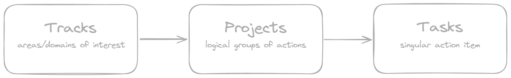
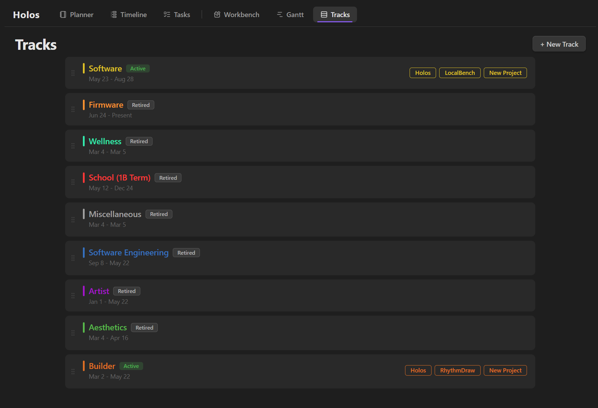
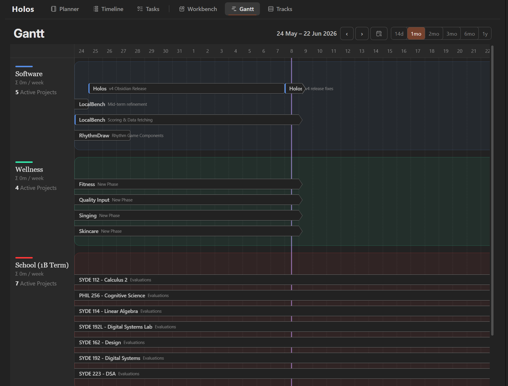
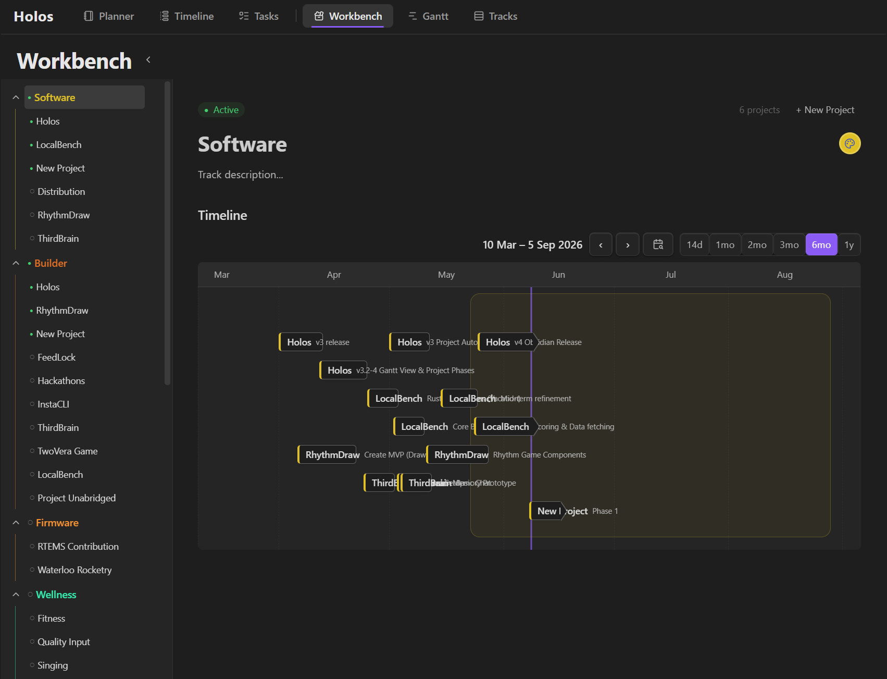
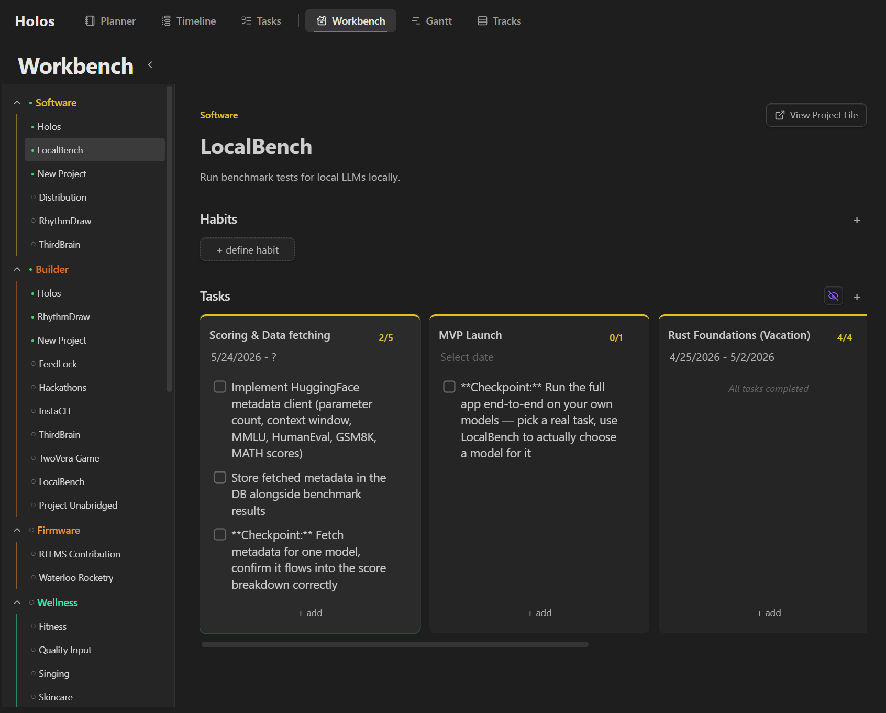
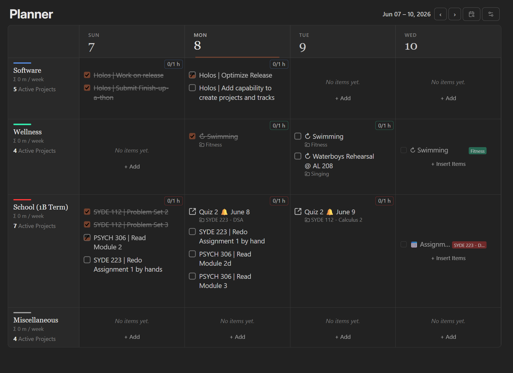
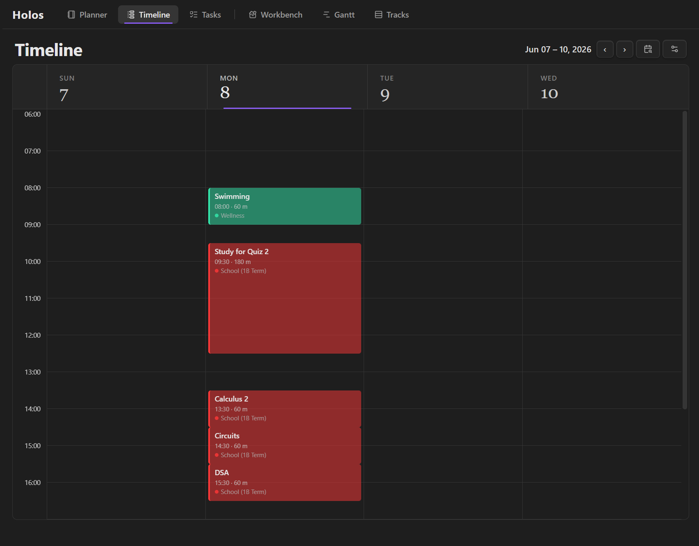
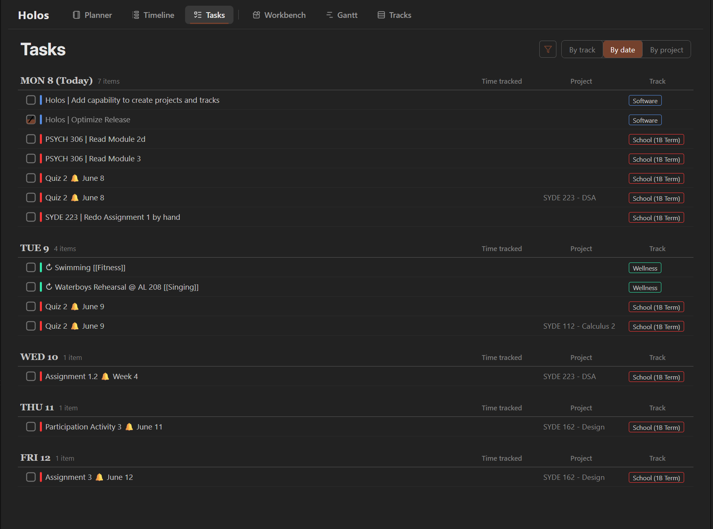

An integrated productivity system for Obsidian that bridges the gap between big-picture life planning and daily execution.

Most productivity setups are fragmented: Google Calendar for scheduling, Obsidian for planning, a separate app for tasks. None of them connect "what am I focusing on this season of my life?" to "what am I actually doing today?"

Holos fixes that with a three-tier system built entirely inside Obsidian, with everything stored in plain markdown files you can read and edit directly.

---

## Demo

<p align="center">
  <a href="https://www.youtube.com/watch?v=WMvmQQU-uZw">
    
  </a>
</p>

---

## How It Works



### Tracks and Projects
Tracks define what you're focusing on in a current phase of life. They are high-level areas that matter to you right now: work, health, school, a relationship.

Projects live inside tracks and drill into specific areas you're actively working on.Each project has phases, which contain tasks to complete, and recurring habits that you can define.






### Tasks
Tasks come together in 3 views, each with their own focus.

The Planner view is a grid where each column is a day, and each row is a track. This allows you to see what you've doing today across every area of your life, all in one place.

The Planner grid is the most powerful, within each cell grid, you can:
- Add tasks using plain text formatting (inspired by markdown — type it, it renders when you click away)
- Set time labels and durations on individual tasks
- Track time commitment per cell, automatically tallied in the corner
- Drag and drop tasks across days or within the same day
- Navigate infinitely forward and backward through your history
- Configure how many days are visible at once

Every cell links back to a markdown file. Everything you see in the grid is real, editable plain text in your vault.



The Timeline view helps you visualize how tasks fit together within your day.


The Tasks view is a list that acts as your todo-list. 


---
### Task Syntax

I'm currently still working on a simpler task editor. In the meantime, tasks use these syntax (so we can store it in markdown).

```
- An event
- [ ] A task
- [/] A partially completed task
- [-] A cancelled task
- [x] A completed task
- Event/task @ 10:00 [1 hr]
- Event/task @ 23:00 [100 min]
- [ ] A task with some progress [1/2 hr]
```

---

## Installation

Holos has not been officially reviewed by Obsidian devs, but is available through the Obsidian plugin marketplace. I use it everyday!

https://community.obsidian.md/plugins/holos

---

## Exigence

Holos started as a personal tool built around my own frustrations. The design went through four complete iterations before landing on what exists today, not just because the architecture evolved, but because understanding how I wanted to organize my life and building the tool to do it had to happen together.

The full story is in the commit history.
